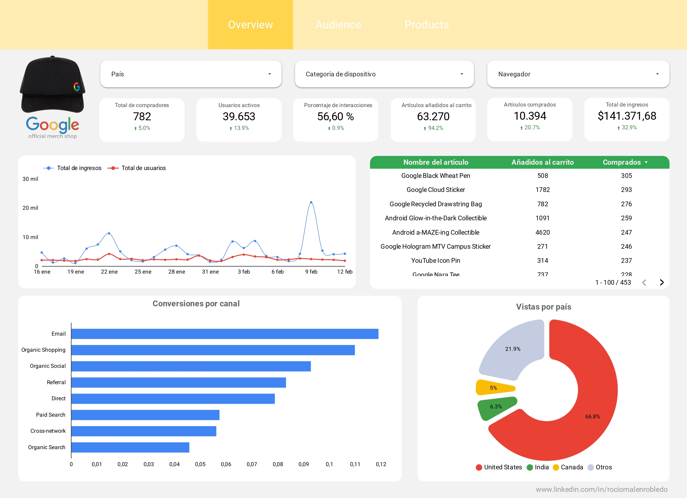
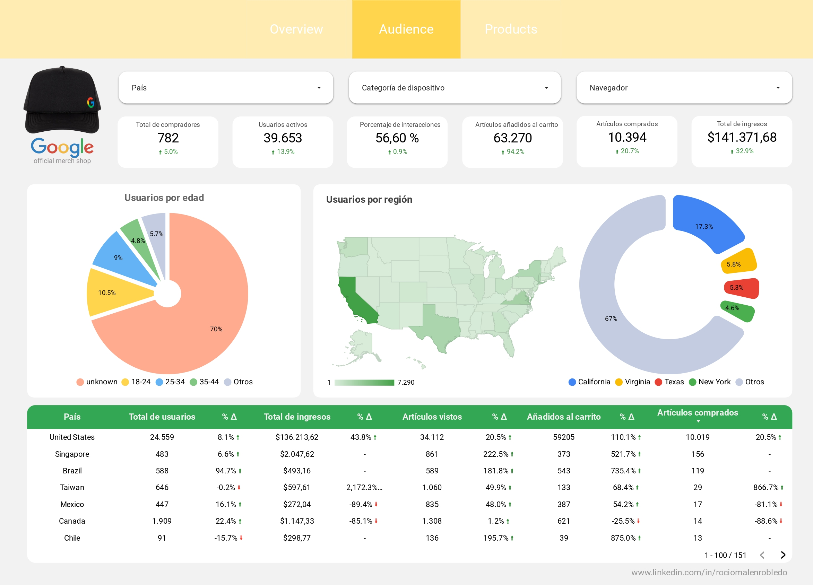
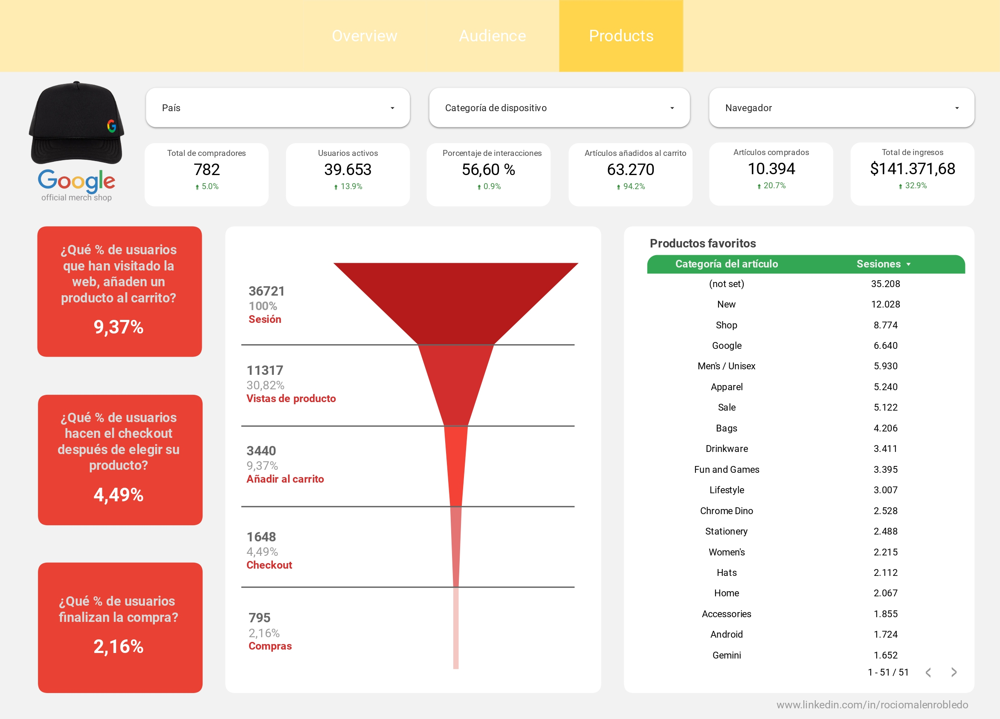

# Google Merch Store - Dashboard Analítico

Dashboard interactivo desarrollado con **Looker Studio** que analiza el rendimiento de Google Merch Store, una tienda online de productos de la marca Google.

  

## 📊 Descripción del proyecto

Este dashboard utiliza la **cuenta demo de Google Analytics 4** para explorar:
- Comportamiento de usuarios
- Funnels de conversión
- Performance e-commerce
- Métricas clave de negocio

## 🛠️ Tecnologías utilizadas
- Google Analytics 4
- Looker Studio

## 🔗 Ver proyecto online
[Click aquí para ver el dashboard](https://lookerstudio.google.com/reporting/193a96e8-3700-4867-a282-2002787934c3)

---

Desarrollado por **Rocio Robledo** - Data & Digital Analyst
